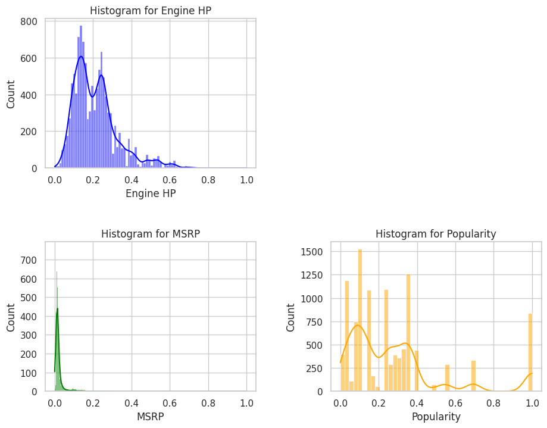
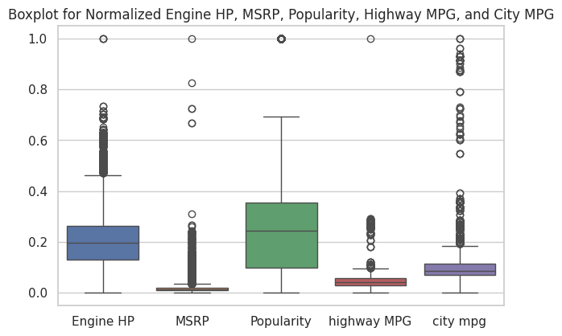
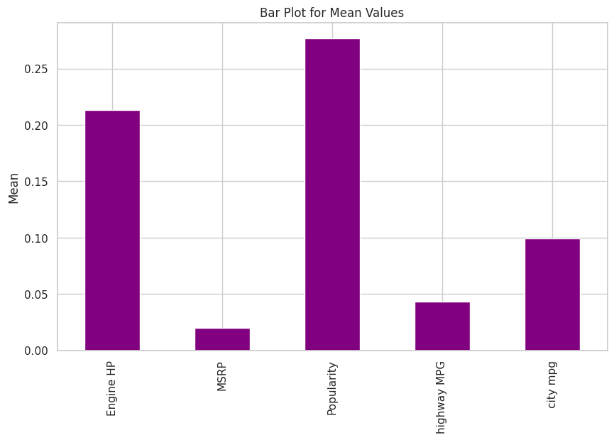

# Car Data Analysis (EDA)

## Overview
Exploratory Data Analysis (EDA) of a vehicle dataset to understand relationships between **price (MSRP)**, **performance** (horsepower), **efficiency** (MPG/EV metrics), and categorical specs (drivetrain, size class, cylinders). The goal is to produce **business-ready insights** and clear visuals that can inform product and pricing decisions.

## Key Objectives
- Clean and prepare raw vehicle data for analysis
- Explore distributions and compare categories (size class, drivetrain, cylinders)
- Quantify correlations (e.g., horsepower ↔ price)
- Surface trade-offs between **performance** and **fuel economy**
- Present findings via clear visuals for stakeholders

## Dataset
- Source: Masterschool training dataset (vehicles)
- Typical fields: `msrp`, `horsepower`, `mpg_city`, `mpg_highway`, `drivetrain`, `size`, `cylinders`, etc.
- Cleaning: type fixes, missing-value handling, deduping, and feature selection

## Methods
- **Wrangling:** `pandas`, `numpy`
- **Visualization:** `matplotlib`, `seaborn` (histograms, boxplots, bar charts, correlation views)
- **Statistics:** correlations and grouped aggregations (e.g., mean MSRP by class)

## Example Visuals
*(These files are in `outputs/` — embedded with your exact filenames.)*
- **Average MSRP — Compact vehicles:**  
  
- **Average MSRP — Large vehicles:**  
  
- **Histograms (distribution checks):**  
  
- **Boxplots (outliers & spread across categories):**  
  
- **Bar plot (feature comparison):**  
  

## Key Insights (high level)
- **Horsepower ↔ Price:** strong positive relationship; higher performance typically commands higher MSRP.
- **Efficiency trade-off:** vehicles with more power tend to have lower MPG; EVs show better efficiency but pricing varies by segment.
- **Category effects:** drivetrain and size class materially shift price and efficiency distributions (visible in boxplots).

## Repo Structure
## Repo Structure

repo/
├─ notebooks/
│ └─ car_data_analysis.ipynb
├─ data/ # (ignored; keep only tiny SAMPLE files if needed)
├─ outputs/ # exported charts for README
├─ requirements.txt
└─ README.md


Requirements
pandas, numpy, matplotlib, seaborn, jupyter, scikit-learn

## How to Run
```bash
# optional: create and activate a virtual environment
python -m venv .venv
# Windows: .venv\Scripts\activate
# macOS/Linux: source .venv/bin/activate

# install dependencies
pip install -r requirements.txt

# launch Jupyter
jupyter lab
# open notebooks/car_data_analysis.ipynb

